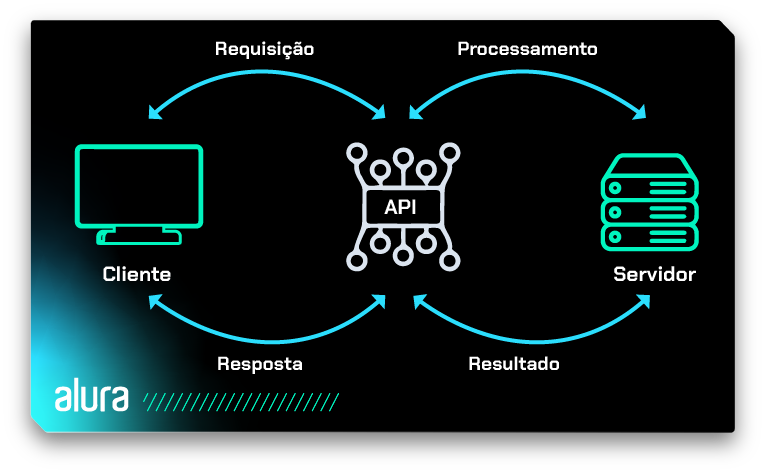

# 🚀 APIs: Desenvolvimento Web

Este repositório foi criado para abordar conceitos e práticas essenciais de integração com APIs RESTful.

---

<!-- toc -->
- [📖 História das APIs](#-história-das-apis)
- [🎯 Para que serve uma API?](#-para-que-serve-uma-api)
  - [Por que usar API?](#por-que-usar-api)
    - [Quais são as vantagens de usar uma API?](#quais-são-as-vantagens-de-usar-uma-api)
- [🌍 APIs Web](#-apis-web)
  - [API SOAP (Simple Object Access Protocol)](#api-soap-simple-object-access-protocol)
  - [APIs REST (Representational State Transfer)](#apis-rest-representational-state-transfer)
  - [Diferenças entre API REST e API SOAP](#diferenças-entre-api-rest-e-api-soap)
- [🔤 HTTP](#-http)
  - [Métodos HTTP Usados no REST](#métodos-http-usados-no-rest)
  - [Identificação dos Recursos](#identificação-dos-recursos)
    - [Exemplo para o recurso Cliente](#exemplo-para-o-recurso-cliente)
  - [Códigos de Resposta HTTP](#códigos-de-resposta-http)
- [🛠️ Postman no VSCode](#-postman-no-vscode)
  - [Alternativas ao Postman](#alternativas-ao-postman)
  - [Instalar a Extensão Postman](#instalar-a-extensão-postman)
  - [Criar e Executar Requisições](#criar-e-executar-requisições)
  - [Analisar Respostas](#analisar-respostas)
- [🌐 Acessando Ferramentas de Fake API](#-acessando-ferramentas-de-fake-api)
  - [Como usar o Mocky](#como-usar-o-mocky)
  - [Exemplos de uso no projeto](#exemplos-de-uso-no-projeto)
- [🔗 Links Úteis](#-links-úteis)
- [📚 Referências](#-referências)
<!-- tocstop -->

---

## 📖 História das APIs

A história das APIs se iniciou nos anos 1960 e 1970, quando os computadores tornaram-se mais comuns e essenciais para diversas tarefas. No entanto, tornou-se necessário encontrar uma maneira de reutilizar códigos para simplificar processos no desenvolvimento.

O termo "interface de programa de aplicação" foi introduzido pela primeira vez em 1968, em um artigo chamado "Estruturas e técnicas de dados para computação gráfica remota". Os autores do artigo usaram o termo para descrever a interação de um aplicativo, neste caso um programa gráfico, com o restante do sistema de computador.

A intenção era criar uma interface de aplicação consistente para que as pessoas responsáveis pela programação não precisassem lidar com as particularidades do dispositivo de exibição gráfica e fornecer independência de hardware, permitindo que o computador ou a tela fossem substituídos sem impactar o funcionamento do aplicativo.

Logo, começaram a surgir alguns protocolos e padrões que serviram como base para as APIs. Por exemplo, na década de 1990 o CGI (Common Gateway Interface) se destacou como uma tecnologia que permitia aos servidores web acionarem scripts ou programas externos para gerar conteúdo dinâmico conforme a demanda. Isso facilitava a criação de páginas dinâmicas.

Ainda na década de **1990**, surgiu o protocolo **SOAP** baseado em XML, possibilitando a comunicação entre sistemas distribuídos via web. O SOAP forneceu uma maneira organizada para os aplicativos realizarem a troca de mensagens, padronizando a comunicação e regras de tratamento de erros.

Posteriormente nos anos **2000**, Roy Fielding publicou sua tese de doutorado que aborda a introdução sobre Transferência de Estado Representacional (Representational State Transfer | REST). Essa foi uma grande contribuição, pois o padrão REST revolucionou a implementação dos serviços web. A API REST rapidamente ganhou popularidade, e métodos HTTP como GET, POST, PUT e DELETE passaram a ser usados como uma forma padrão de interagir com serviços baseados na web.

É notável que os primeiros protocolos e padrões desenvolvidos serviram como base para as tecnologias que envolvem as APIs hoje em dia. As APIs continuam a evoluir com o mesmo propósito: permitir a facilidade na comunicação entre sistemas.

---

## 🎯 Para que serve uma API?

A função principal de uma API é garantir que sistemas com linguagens diferentes possam se integrar de maneira ágil e segura. Por isso, as APIs são utilizadas por negócios de tecnologia que trabalham com softwares, permitindo a integração entre seus próprios sistemas e os produtos de outras empresas.

A API simplifica o trabalho de quem desenvolve, pois com seu uso é possível utilizar códigos já desenvolvidos anteriormente por outras pessoas e aplicá-los em novos programas para resolver problemas comuns em programação. Isso facilita a criação de novos aplicativos, softwares e plataformas em geral, diminuindo tempo e esforço.

### Por que usar API?

Além de possibilitar a conexão de diferentes aplicações, facilitando a vida de usuários, as APIs trazem mais agilidade e praticidade para uma série de processos.

A segurança de dados é outro importante benefício das APIs, uma vez que elas são capazes de bloquear acessos e permissões a informações de softwares e hardwares, algo que nem sempre outras aplicações conseguem.

#### Quais são as vantagens de usar uma API?

As APIs desempenham diversos papéis e oferecem vários benefícios, incluindo:

- **Interoperabilidade:** permitem que diferentes sistemas, plataformas e aplicativos se comuniquem entre si de maneira padronizada, facilitando a integração de componentes de software distintos.
- **Acesso a funcionalidades:** uma API permite que pessoas desenvolvedoras acessem e utilizem as funcionalidades específicas de um software sem precisar entender os detalhes internos dele. Dessa forma podemos criar aplicações mais complexas, que se beneficiem das capacidades de vários serviços.
- **Reutilização de código:** ao oferecer uma interface para funcionalidades específicas, uma API permite que o código seja reutilizado em diferentes contextos. Isso reduz a redundância e melhora a eficiência do desenvolvimento.
- **Desenvolvimento rápido:** em vez de construir uma aplicação do zero, quem desenvolve pode utilizar APIs para incorporar funcionalidades já existentes, economizando tempo e recursos.
- **Integração de serviços:** APIs são frequentemente usadas para integrar serviços de terceiros em uma aplicação. Por exemplo, o login de uma aplicação pode ser terceirizado para um serviço de autenticação via API.
- **Distribuição de dados:** APIs permitem que dados sejam compartilhados entre diferentes sistemas. Isso é especialmente útil em ambientes nos quais diferentes partes precisam acessar e atualizar informações.
- **Atualização independente:** permite que partes do software sejam atualizadas independentemente umas das outras, desde que a interface da API permaneça consistente. Isso facilita a manutenção e evolução contínua de sistemas complexos.
- **Economia de recursos:** pessoas desenvolvedoras podem utilizar APIs para alavancar serviços e recursos já existentes, evitando a necessidade de reinventar a roda e economizando recursos de desenvolvimento.

---

## 🌍 APIs Web

A API baseadas em Web serve como uma ponte eficaz entre o cliente e o servidor. Para isso, utiliza protocolos da web, como HTTP. Assim, permite a comunicação entre sistemas pela internet e, consequentemente, que aplicações diferentes interajam e compartilhem dados de forma padronizada, independentemente da tecnologia utilizada em cada extremidade.

Seu funcionamento acontece da seguinte forma:

1. O servidor aguarda por requisições.
2. O cliente envia uma requisição HTTP para o endpoint adequado no servidor (por exemplo, GET /tasks ou POST /tasks).
3. O servidor processa a requisição, realiza as operações necessárias (obter ou adicionar tarefas) e retorna uma resposta ao cliente, geralmente em formato JSON.
4. O cliente recebe a resposta e pode então processar os dados conforme necessário.



Os protocolos HTTP e HTTPS estabelecem uma padronização para as mensagens de requisição e resposta. Em grande parte dos casos, essas mensagens são formatadas em XML (Extensible Markup Language) ou JSON (JavaScript Object Notation), como exemplificado abaixo:

**Estrutura de mensagens formatadas em JSON:**

```json
{
  "lista_pessoas": {
    "pessoas": [
      {
        "nome": "João Silva",
        "sexo": "M",
        "idade": "22"
      },
      {
        "nome": "Maria Eduarda",
        "sexo": "F",
        "idade": "21"
      },
      {
        "nome": "Pedro Gomes",
        "sexo": "M",
        "idade": "18"
      }
    ]
  }
}
```

**Estrutura de mensagens formatadas em XML:**

```xml
<lista_pessoas>
  <pessoas>
    <nome>João Silva</nome>
    <sexo>M</sexo>
    <idade>22</idade>
  </pessoas>
  <pessoas>
    <nome>Maria Eduarda</nome>
    <sexo>F</sexo>
    <idade>21</idade>
  </pessoas>
  <pessoas>
    <nome>Pedro Gomes</nome>
    <sexo>M</sexo>
    <idade>18</idade>
  </pessoas>
</lista_pessoas>
```

Podemos observar que o formato XML utiliza tags para envolver os dados, tornando-o mais verboso e, por vezes, complexo. Em contrapartida, o JSON é mais conciso, utiliza uma sintaxe baseada em pares chave-valor e é facilmente legível tanto para humanos quanto para máquinas.

Tanto XML quanto o formato JSON são utilizados para auxiliar na troca de mensagens em diferentes protocolos e arquiteturas. No contexto dessas comunicações, é relevante mencionar duas abordagens comuns: SOAP e REST.

---

### API SOAP (Simple Object Access Protocol)

O SOAP é um protocolo de comunicação que serve para facilitar a troca de informações entre sistemas e aplicativos. Por se tratar de um protocolo, ele estabelece um conjunto de convenções que definem a estrutura das mensagens e métodos que serão utilizados na comunicação entre os sistemas.

Ao adotar o SOAP, os envios e recebimentos de dados são encapsulados em documentos XML, proporcionando uma formatação consistente e padronizada. Este protocolo suporta a transmissão de requisições através de protocolos como HTTP e SMTP, permitindo uma grande possibilidade na integração entre sistemas.

A estrutura de uma mensagem SOAP pode ser definida da seguinte maneira:

- **Envelope:** é o elemento raiz que envolve toda a mensagem e traz dois filhos, Header (Cabeçalho) e Body (Corpo). O cabeçalho é um elemento opcional, enquanto o corpo é um elemento obrigatório.
- **Cabeçalho:** é um elemento usado para transmitir informações relacionadas a autenticação, identificação de transações e outros detalhes relevantes.
- **Corpo:** é um elemento que contém as informações específicas da operação ou serviço que serão transportadas entre os sistemas.

As APIs construídas com SOAP geralmente são sistemas com requisitos e regulamentos rígidos de segurança, pois ele oferece suporte a WS-Security, um conjunto de extensões que permite a integração de recursos de segurança, tais como autenticação, autorização, confidencialidade e integridade das mensagens trocadas entre os clientes e servidores web.

Alguns casos de uso comuns em APIs SOAP são: transações financeiras, reserva de viagens, serviços de saúde, integração de sistemas empresariais e etc.

### APIs REST (Representational State Transfer)

As APIs construídas com base na arquitetura REST seguem um estilo que incorpora os princípios fundamentais da web, visando o desenvolvimento de aplicações escaláveis e eficientes.

O formato JSON é comumente adotado para a transmissão de dados e as operações padrão do protocolo HTTP (GET, POST, PUT, PATCH e DELETE) são empregadas para realizar interações com os recursos.

As APIs REST podem ser desenvolvidas utilizando uma grande quantidade de linguagens de programação. No entanto, é crucial que essas APIs estejam alinhadas com os seis princípios de design REST a seguir:

1. **Interface uniforme:** possibilita a comunicação entre cliente e servidor de forma consistente, independentemente dos detalhes de arquitetura do backend. Essa interface deve oferecer um método padronizado de interação, por exemplo, HTTP com URIs, operações CRUD (Criar, Ler, Atualizar, Excluir) e o formato JSON.
2. **Separação cliente-servidor:** o cliente e o servidor devem ser completamente independentes um do outro, sendo a comunicação do cliente para o servidor realizada pela URI do recurso a ser solicitado.
3. **Sem estado definido:** a API não deve ter estado definido, o que significa que cada solicitação precisa incluir todas as informações necessárias para processá-la.
4. **Capacidade de armazenamento em cache:** é recomendado que tanto o cliente quanto o servidor armazenem temporariamente recursos em cache. No contexto do servidor, quando um recurso é solicitado e há uma alta probabilidade de ser buscado novamente dentro de um período específico, é indicado que seja armazenado em cache para proporcionar respostas mais rápidas. Além disso, a resposta do servidor deve indicar se um recurso pode ser colocado em cache de forma local e segura no cliente.
5. **Arquitetura de sistema em camadas:** é recomendado estruturar o sistema em camadas, de modo que cada camada possui uma função específica. Essa abordagem ajuda a dividir o sistema em partes menores, facilitando a sua organização e tornando-o mais capaz de crescer conforme necessário.
6. **Código sob demanda:** é uma característica opcional que permite ao servidor enviar código executável (como applets Java ou scripts JavaScript) para ser executado pelo cliente, estendendo as capacidades do cliente de forma dinâmica.


### Diferenças entre API REST e API SOAP

API REST e API SOAP são duas formas para a transmissão de dados e para manter a interoperabilidade entre sistemas. Veja as principais diferenças:

- SOAP é um protocolo, enquanto o REST é um padrão de arquitetura;
- SOAP é independente de linguagem, transporte e até plataforma, enquanto o REST requer o uso do protocolo HTTP;
- SOAP é uma abordagem muito presente ainda em sistemas legados, enquanto REST surgiu posteriormente e costuma ser vista como uma solução mais eficiente em questão de performance nos casos baseados em web;
- Para contextos mais leves como IoT (Internet das coisas), desenvolvimento de aplicações serverless e mobile é recomendado o REST, para sistemas que requerem mais segurança e muitas necessidades empresariais é recomendado o SOAP;
- O formato dos dados do SOAP é somente por meio de XML, enquanto o REST oferece suporte a XML, JSON, HTML e texto simples.

---

## 🔤 HTTP

Os recursos gerenciados por uma aplicação, e identificados unicamente por meio de sua URI, geralmente podem ser manipulados de diversas maneiras: criá-los, atualizá-los, excluí-los, entre outras operações.

Quando um cliente faz uma requisição HTTP para um serviço, além da URI que identifica o recurso, é necessário informar o tipo de manipulação desejada. Para isso, utilizam-se os métodos do protocolo HTTP, cada um com uma semântica distinta:

Os principais métodos HTTP utilizados em APIs REST são:

| Método  | Descrição                                                                 |
|---------|---------------------------------------------------------------------------|
| **GET**    | Recupera dados de um recurso no servidor. Não altera o estado do recurso.         |
| **POST**   | Cria um novo recurso no servidor.                                      |
| **PUT**    | Atualiza completamente um recurso existente no servidor.                |
| **DELETE** | Remove um recurso do servidor.                                         |
| PATCH  | Atualiza parcialmente um recurso existente no servidor.                 |
| OPTIONS| Retorna os métodos HTTP suportados por um endpoint.                    |
| HEAD   | Recupera apenas os headers da resposta, sem o corpo.                   |


### Identificação dos Recursos

No modelo REST, cada informação gerenciada pela aplicação é chamada de **recurso** (ex: produtos, clientes, vendas). Um dos princípios do REST é que todo recurso deve possuir uma identificação única, geralmente feita por uma **URI** (Uniform Resource Identifier).

Exemplos de URIs:
- `http://servicorest.com.br/produtos`
- `http://servicorest.com.br/clientes`
- `http://servicorest.com.br/clientes/57`
- `http://servicorest.com.br/vendas`

As URIs funcionam como o contrato de acesso aos recursos do serviço.

**Boas práticas para URIs:**
- Use nomes legíveis e relacionados ao domínio da aplicação.
- Mantenha um padrão consistente (ex: sempre plural, sem misturar camelCase e snake_case).
- Não inclua a operação na URI (ex: evite `/produtos/cadastrar`, use apenas `/produtos` e o método HTTP adequado).
- Não inclua o formato de resposta na URI (ex: evite `/produtos/xml`; use Content Negotiation).
- Evite alterar URIs após publicá-las; se necessário, notifique os clientes e, se possível, mantenha redirecionamentos.

#### Exemplo para o recurso **Cliente**:

| Método  | URI              | Utilização                                 |
|---------|------------------|--------------------------------------------|
| GET     | /clientes        | Recuperar os dados de todos os clientes.   |
| GET     | /clientes/id     | Recuperar os dados de um cliente específico.|
| POST    | /clientes        | Criar um novo cliente.                     |
| PUT     | /clientes/id     | Atualizar os dados de um cliente.          |
| DELETE  | /clientes/id     | Excluir um cliente.                        |

**Boas práticas:**  
Evite utilizar apenas o método POST para todas as operações que alteram o estado no servidor (cadastro, alteração, exclusão) e, principalmente, não utilize o método GET para operações que modificam dados, pois navegadores podem fazer cache de requisições GET, disparando-as automaticamente.

### Códigos de Resposta HTTP

| Código | Significado             | Descrição                                                                 |
|--------|------------------------|---------------------------------------------------------------------------|
| 200    | OK                     | Requisição bem-sucedida.                                                  |
| 201    | Created                | Recurso criado com sucesso.                                               |
| 204    | No Content             | Requisição bem-sucedida, sem conteúdo de retorno.                         |
| 302    | Found                  | Em requisições feitas à URIs antigas, que foram alteradas.                |
| 400    | Bad Request            | Requisição inválida, geralmente por erro de sintaxe.                      |
| 401    | Unauthorized           | Autenticação necessária ou falhou.                                        |
| 403    | Forbidden              | Permissão negada para acessar o recurso.                                  |
| 404    | Not Found              | Recurso não encontrado.                                                   |
| 409    | Conflict               | Conflito com o estado atual do recurso.                                   |
| 422    | Unprocessable Entity   | Entidade não processável (erro de validação).                             |
| 429    | Too Many Requests      | Limite de requisições atingido pelo cliente.                              |
| 500    | Internal Server Error  | Erro interno no servidor.                                                 |
| 502    | Bad Gateway            | Gateway ou proxy recebeu resposta inválida do servidor upstream.           |
| 503    | Service Unavailable    | Serviço indisponível, geralmente por manutenção ou sobrecarga.

## 🛠️ Postman no VSCode
O **Postman** é uma ferramenta popular para desenvolvimento, teste e documentação de APIs, oferecendo interface intuitiva, automação de testes e integração com o VSCode.

**Alternativas ao Postman:**
- **[Insomnia](https://insomnia.rest/):** Simples, rápido, com suporte a REST, GraphQL e gRPC, além de integração com fluxos DevOps.
- **[UseBruno](https://www.usebruno.com/):** Open source, leve, orientado a arquivos, facilita versionamento e não exige cadastro.

Cada ferramenta tem vantagens específicas para diferentes necessidades de desenvolvimento. Vamos seguir com as instruções do Postman com uso no VSCode (ou CodeSpace).

### Instalar a Extensão Postman
- **Instale a extensão Postman no VSCode**:
  - No Marketplace, busque por **Postman** e clique em **Install**.
  - Abra a extensão e faça login ou crie uma conta.

### Criar e Executar Requisições

### **1. Acessar a extensão**:
   - Na barra lateral, clique no ícone do **Postman**.

### **2. Criar nova requisição**:
   - Clique em **New Request**.
   - Insira detalhes da requisição:
     - **Método**: `GET`, `POST`, etc.
     - **URL**: Substitua variáveis de ambiente se necessário, por exemplo:
       ```
       {{base_url}}/endpoint
       ```
   - **Adicione headers**:
     - Exemplo para autenticação:
       ```json
       {
         "Authorization": "Bearer {{token}}",
         "Content-Type": "application/json"
       }
       ```
   - **Adicione body** (para métodos como `POST` ou `PUT`):
     ```json
     {
       "campo1": "valor1",
       "campo2": "valor2"
     }
     ```

### **3. Executar a requisição**:
   - Clique no botão **Send** para enviar a requisição e veja a resposta no painel.

### Analisar Respostas
A extensão exibe:

- **Status HTTP**: (ex.: `200 OK`, `404 Not Found`).
- **Headers de resposta**: Mostra metadados, como tipo de conteúdo.
- **Body**: O corpo da resposta em JSON, texto ou outro formato.

## 🌐 Acessando Ferramentas de Fake API

Para praticar com APIs mesmo sem um backend real, você pode utilizar ferramentas de Fake API:

- **[Strapi.io](https://strapi.io/)**: (+indicada) Permite construir APIs e modelagem de dados de forma simples. É mais customizável que as outras ferramentas e possui uma interface Cloud que facilita a criação e manutenção dos endpoints.
  - Dica rápida para criar localmente:  
    ```bash
    npx create-strapi-app@latest my-mock-api --quickstart
    ```
    Após criar o projeto, a plataforma será aberta no seu navegador e você poderá criar estruturas de dados para seu backend.

Ao usar essas ferramentas, você pode testar requisições e validar respostas sem depender de uma API em produção ou em desenvolvimento.

- **[Mocky](https://designer.mocky.io/)**:
  Crie suas próprias respostas simuladas, com controle sobre o conteúdo retornado e o status HTTP. 
  
  ### Como usar o Mocky:
  1. Acesse o [Mocky Designer](https://designer.mocky.io/).
  2. Crie uma nova resposta personalizada:
      - Escolha o **status HTTP** (ex.: 200, 404, 500).
      - Defina o conteúdo do **body** (em JSON, XML, etc.).
      - Configure os **headers**, se necessário.
  3. Clique em **Save** para gerar um link único.
  4. Use o link gerado como endpoint em seus testes com o Postman ou diretamente em projetos React.

  ### Exemplos de uso no projeto:
  - Simulação de respostas para CRUD:
    ```json
    {
      "id": 1,
      "nome": "Lana Mesquita",
      "curso": "Desenvolvimento Web"
    }
    ```
  - Teste de falhas controladas:
    - Status `500` com mensagem personalizada:
      ```json
      {
        "erro": "Erro interno no servidor"
      }
      ```

- **[JSONPlaceholder](https://jsonplaceholder.typicode.com/)**:
  Uma Fake API gratuita que fornece endpoints para testes de CRUD com dados fictícios.

- **[Reqres](https://reqres.in/)**:
  API para testar requisições de autenticação e operações CRUD.

---

## 🔗 Links Úteis

- [Diferença entre URL e URI | Hostinger](https://www.hostinger.com/br/tutoriais/uri-e-url) — Explica de forma clara a diferença entre URL e URI.

- [Como criar uma API em JavaScript com Express | Rocketseat](https://www.rocketseat.com.br/blog/artigos/post/rest-api-desvendando-o-poder-das-aplicacoes-web)

---

## 📚 Referências

- [API: o que é, para que serve e como funciona? | Alura](https://www.alura.com.br/artigos/api?srsltid=AfmBOopS2t2C-J3ofwhkdyaqwMwEFBw_vt9aiQOhZI-By3HltibBjTqG)
- [REST: princípios e boas práticas | Alura](https://www.alura.com.br/artigos/rest-principios-e-boas-praticas)
- [REST | Wikipédia](https://pt.wikipedia.org/wiki/REST)
- [Engenharia de Software Moderna - Capítulo 7: REST](https://engsoftmoderna.info/cap7.html)
